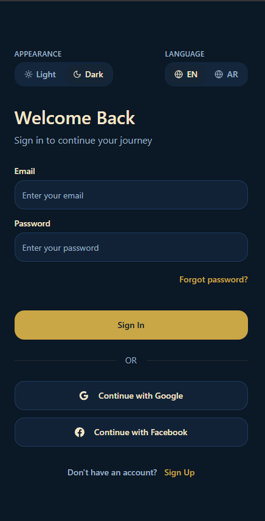
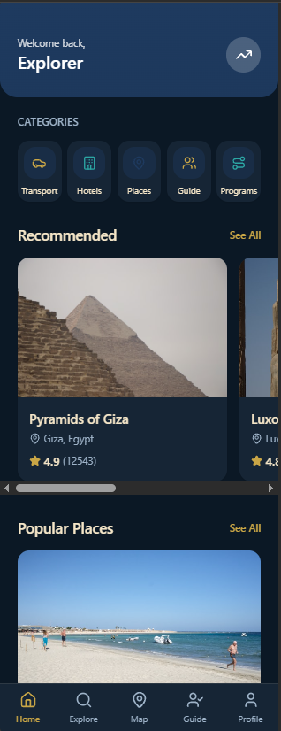
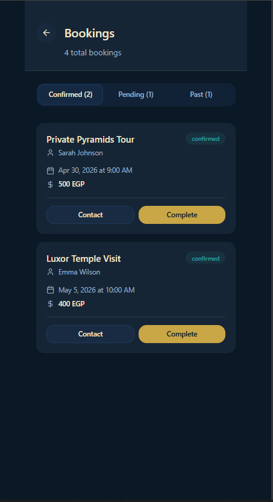
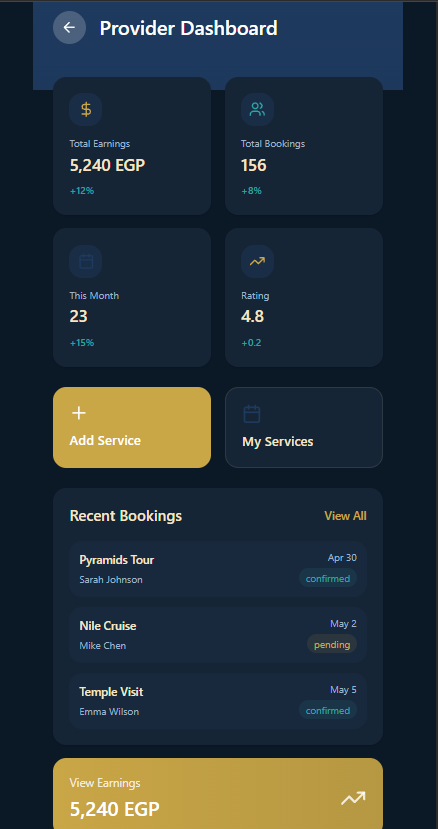

# TourismG API

## Short description

TourismG API is a backend service for a mobile/web tourism application. It provides endpoints for providers and customers to manage and book services such as hotels, transports, programs, and guides. The API is built with ASP.NET Core targeting .NET 10 and uses Entity Framework Core for data access.

## Tech stack

- .NET 10 (ASP.NET Core)
- Entity Framework Core
- Microsoft Identity for authentication
- SQL Server (connection configured in appsettings / Program.cs)
- SignalR for realtime features

## Projects / repository structure

- Domain/ : Domain models and interfaces
- Application/ : Application services, DTOs, business logic
- Infrastructure/ : EF DbContext, repositories, migrations
- TourismG_API/ : Presentation layer (controllers, Program.cs)
- UI/ : (optional) Frontend or client project (screenshots referenced below)

## Quick start

1. Update connection string in TourismG_API/appsettings.json (or Program.cs) to point to your SQL Server instance.
2. Run EF Core migrations (if needed):
   - dotnet ef database update --project Infrastructure --startup-project TourismG_API
3. Open the solution in Visual Studio 2026 or run from terminal:
   - dotnet build
   - dotnet run --project TourismG_API
4. Use Swagger at /swagger to explore the API (when running in development).

## Notes about authentication

The API uses ASP.NET Core Identity. Seeded test credentials are documented in the Swagger setup in Program.cs. For protected routes, obtain a JWT and include it as a Bearer token.

## Booking behavior

- Booking endpoints create records in dedicated booking tables (HotelBookings, TransportBookings, ProgramBookings, GuideBookings) and update parent entity availability (AvailableRooms / AvailableSeats / AvailableSpots) where applicable.
- If a booking is created with insufficient inventory, the API returns an error.

## UI folder and screenshots

If you have a UI folder in the repository, place frontend files there. To make the README visually helpful, add screenshots under UI/screens and reference them below.

## Screenshots

Login screen

Home / Browse services

Booking flow

Provider dashboard

(If the images are not present, add PNG/JPG files to UI/screens with the names above.)

## API highlights

- GET /api/services - list public services
- POST /api/hotels/{id}/book - create a hotel booking (authenticated)
- POST /api/transports/{id}/book - book transport (authenticated)
- POST /api/programs/{id}/book - book program (authenticated)
- POST /api/guides/{id}/book - book guide (authenticated)
- GET /api/bookings/my - view current user's bookings (authenticated)

## Contributing

Pull requests are welcome. Keep changes focused and include tests where appropriate.

## License

Add your project license here (e.g., MIT).
